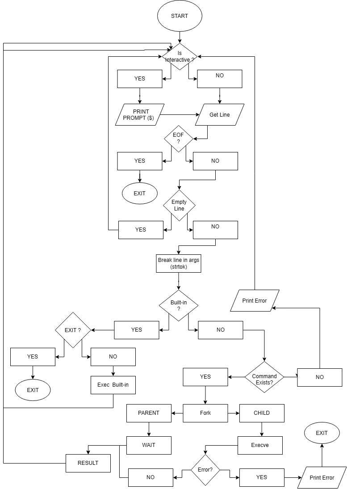

# C - Simple Shell

## Description

This project is a custom UNIX command-line interpreter (shell) implemented in C as part of the **Holberton School** curriculum. It replicates the basic core functionalities of `sh` (`/bin/sh`): it reads a command line from standard input, splits it into arguments, searches for the corresponding executable in the `PATH`, and runs it in a child process via `fork` and `execve`.

It supports both interactive mode (with a `$ ` prompt) and non-interactive mode (piped input), and implements the `exit` and `env` builtins.

## Learning Objectives

* Understand how a command-line interpreter works under the hood.
* Master process creation and management using `fork`, `execve`, and `wait`.
* Handle the `environ` array and use the `PATH` variable to locate executables.
* Manage dynamic memory allocation and cleanup to avoid leaks.
* Handle end of file (`Ctrl+D`) gracefully.

## Compilation

```bash
gcc -Wall -Werror -Wextra -pedantic -std=gnu89 *.c -o hsh
```

## Usage

### Interactive mode

```console
$ ./hsh
$ /bin/ls
main.c  main.h  execute.c  builtins.c  hsh
$ pwd
/home/user/holbertonschool-simple_shell
$ exit
```

### Non-interactive mode

```console
$ echo "/bin/ls" | ./hsh
main.c  main.h  execute.c  builtins.c  hsh
$ echo "pwd" | ./hsh
/home/user/holbertonschool-simple_shell
```

## Flowchart

<picture>
  <source media="(prefers-color-scheme: dark)" srcset="assets/flowchart-dark.png">
  <source media="(prefers-color-scheme: light)" srcset="assets/flowchart-light.png">
  
</picture>

## Builtins

| Command | Description |
| --- | --- |
| `exit` | Exits the shell. |
| `env` | Prints the current environment. |

## File Structure

| File | Description |
| --- | --- |
| [main.h](main.h) | Header file with structures, macros, and function prototypes. |
| [main.c](main.c) | Entry point; reads input and drives the main shell loop. |
| [split_string.c](split_string.c) | Splits a command line into tokens (arguments). |
| [wich.c](wich.c) | Searches `PATH` for a command and returns its full path. |
| [_getenv.c](_getenv.c) | Retrieves the value of an environment variable. |
| [execute.c](execute.c) | Forks a child process and executes the command via `execve`. |
| [builtins.c](builtins.c) | Implements the `exit` and `env` builtins. |
| [freeall.c](freeall.c) | Helper to free multiple allocated pointers at once. |

## Authors

* **The TO** - [theovinc@gmail.com](mailto:theovinc@gmail.com)
* **Reborn** - [reborndiscord@gmx.fr](mailto:reborndiscord@gmx.fr)

Holberton School project.
